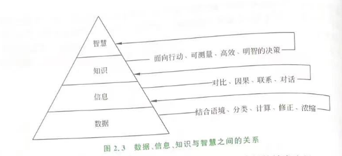
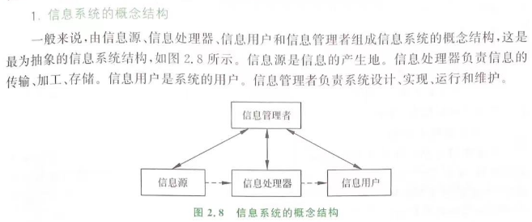
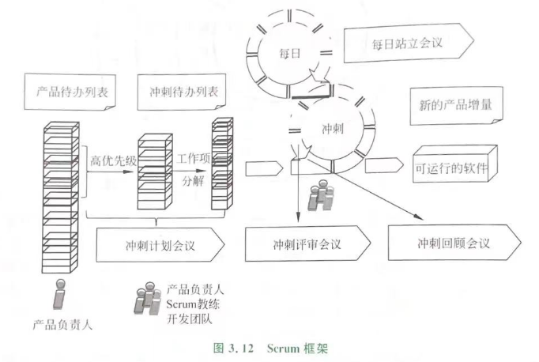
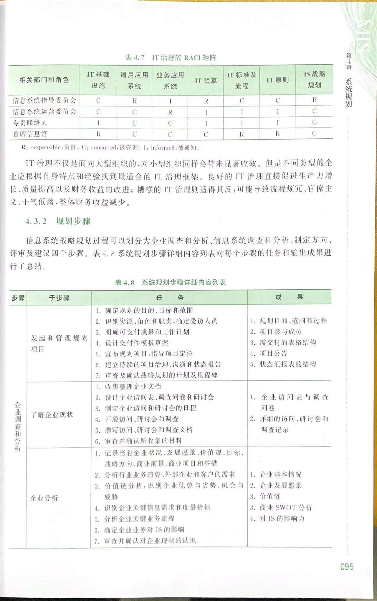
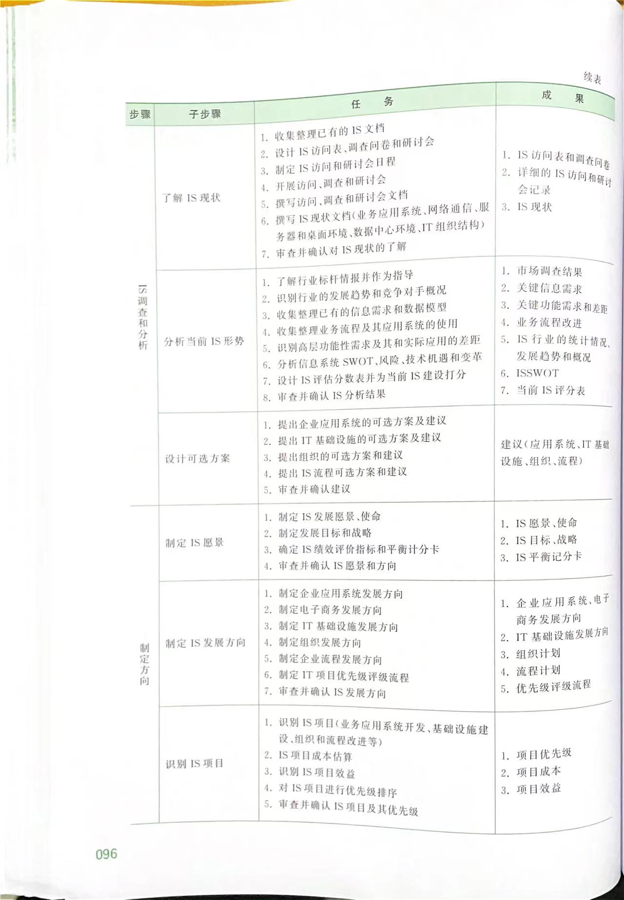
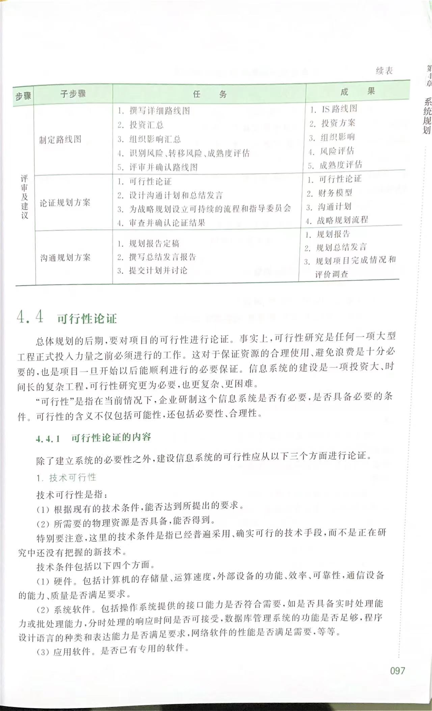

> 本文为读书【《信息系统分析与设计》 --- 王晓敏 】的关键知识笔记

## 先行知识

### 数据、信息、知识、智慧定义

> P22

* 数据：是一组表示数量、行为和目标的可鉴别的非随机符号。它可以是字母、数字或其他符号，也可以是图形、图像、声音等。是信息系统的原材料。

* 信息：是经过加工后的数据，它对接收者有用，对决策或行为有现实或潜在的价值。信息具有以下特征：
  1. 事实性：是信息的最基本属性，记录真实的事件或事件数据；
  2. 扩散性：是信息的本性。信息浓度越大，扩散性越强；
  3. 传输性：可以通过各种手段传输到很远的地方；
  4. 共享性：信息可以共享但不能交换，不会因为某人获得了信息而使其他人的信息减少；
  5. 增值性：在某一目的下，随着时间、数量粒度上不断增加的信息，具有增值性。比如用过去天气信息预测未来；
  6. 不完全性：客观事实的知识不可能完全得到；
  7. 等级性：不同级别的管理者对同一事物所需的信息是不同的，故信息也分等级，一般分为战略级、战术级、作业级；
  8. 滞后性：数据经过加工后才可能成为信息，利用信息决策才能产生结果。中间的时间间隔总不为零，故具有滞后；

* 知识：是一种特定的信息，通过语言、文字、图片等形式表现出来，具有信息的一切数据，属于信息的范畴。

* 智慧：代表着人们辨析、判断和发明创造的能力。是知识和信息经过人类大脑内化后转换为对事务理解和处理的能力，具有明智决策、促进活动高效顺利完成的特征。

### 信息与管理

> P24

信息在管理过程起着基础性的作用，下面从管理职能的角度分析：

1. 信息是制定计划的基本依据：拥有信息的质量决定计划的质量。例如利用过去、现在的实际信息，反应未来的趋势；
2. 信息是组织实施的保证：具体的信息作为前提条件，才能保证活动的顺利进行。例如拥有具体的信息才能合理设置机构、配备人员、调动财力；
3. 信息是调节控制的指示器：通过反映系统运行状态的检测信息，通过调节实际的参数来接近目标；
4. 信息是激励职工的依据：职工的奖惩需要度量职工业绩的信息；
5. 信息是领导指挥的基础：领导者需要掌握组织的全面信息

### 不同管理层的信息区别

> P25

分为：

战略信息：供高层管理人员进行战略决策时用。

战术信息：供中层管理人员完成计划、资源分配用。

业务信息：供基层业务人员和管理人员执行已指定计划、组织生产或服务活动时用。

## 信息系统的定义

Gondon B.Davis: 是一个利用计算机硬件和软件，手工作业，分析，计划，控制和决策模型以及数据库的人机系统，它能提供信息，支持企业或组织的运行、管理和决策功能。

信息系统：是结合管理理论和方法，应用信息技术解决管理问题，为管理决策提供支持的系统。

## 信息系统的功能

信息系统具有数据的采集和输入、传输、存储、处理、输出等基本功能。

## 信息系统的结构

### 概念结构

### 逻辑结构

拆分子系统并提供该子系统功能对应的信息

### 物理结构

集中式： 主机-终端（host-terminal）系统

分布式：文件服务器，传统客户机-服务器（client-server，C/S），浏览器-服务器（browser/server，B/S），服务器集群，云计算

## 信息系统的分类

按照技术发展来对信息系统进行分类结合了时间和技术两个维度，一般认为信息系统的发展已经经历了数据处理系统、管理信息系统、决策支持系统、主管支持系统、商务智能系统、人工智能系统六个阶段。（P37）

由以上介绍可知，信息系统的技术是从解决结构化问题逐步向解决半结构化和非结构化问题发展的。

## 信息系统与组织

信息、管理和信息系统三者的关系可以这样理解：信息是主体，管理是目的，信息系统是手段。信息、管理和信息系统三者的关系可以这样理解：信息反应了组织内部和外部相关组织的各种资源、关系和活动状态；管理是组织利用信息从事协调、控制以达成组织目标的活动过程；信息系统是对组织管理职能的技术支持系统

## 信息系统建设

> P51

### 复杂性

由于信息系统的多学科性、综合性，建设周期长、投资大、风险大，比一般的技术工程有更大的难度和复杂度。

### 系统方法的应用

> P54

1. 还原论与整体论相结合：进行系统分解时，各个部分是相对独立而不是孤立的
   * 还原论：将系统分解为若干部分相对独立的子系统，通过研究清楚子系统就可以获得整个系统的性质；
   * 整体论：将系统分解为若干部分研究，但不是将整体看作是各个部分的简单叠加，即整体大于部分之和
2. 微观分析和宏观综合相结合：微观描述过度到整体宏观描述
   * 微观分析：了解系统的层次结构
   * 宏观综合：了解系统的功能结构及形成过程
3. 定性判断和定量计算相结合：
   * 定性判断：通过定性分析，建立信息系统总体及子系统的概念模型，再尽可能将它们转化为数学模型或计算机模型
   * 定量计算：计算机擅长定量计算
4. 严格生命周期阶段与反复迭代相结合：开发过程既要强调不同阶段任务的严格划分，同时也允许不断修正和迭代

### 系统建模

定义：系统建模是指以某种确定的形式（如文字、符号、图标、数学公式等），对系统某一方面本质属性的描述。是研究复杂系统问题的基本手段

目的：

1. 对复杂问题进行简化描述，帮助有关人员简单、直观、准确地了解系统本质；
2. 统一的交流工具：各阶段产生的模型为后续阶段的有关人员提供工作依据；为项目验收和将来的维护工作提供文档依据；
3. 利用工具将模型映射为特定平台的可执行代码，减少开发人员的工作量；

### 生命周期（开发分为哪几个阶段）

> P61

信息系统的生命周期可以分为五个阶段：

1. 系统规划：对企业的环境、目标及现行系统的状况进行初步调查，根据目标和发展战略，分析将建设的信息系统的必要性和可能性，并对需求做出分析与预测。输出可行性分析报告、**系统设计任务书**
2. 系统分析：根据系统设计任务书、业务流程，提出新系统的逻辑模型（逻辑设计阶段），这也是与一般工程项目的重要区别。确定功能并输出**系统说明书**（系统设计和将来验收的的依据）
3. 系统设计：根据系统说明书、实际条件，输出技术方案（物理设计阶段），输出**系统设计说明书**
4. 系统实施：根据系统设计说明书，分阶段生成实施计划（如购置、安装、调试计算机设备，编写和调试程序，系统测试，系统交付等）
5. 系统运维与管理 ：系统投入使用后，需要经常进行运行记录、维护、变更、审计等，记录系统的运行情况，并进行必要的修改，评价系统的工作质量和经济效益

### 基于生命周期的开发方法

开发方法有以下：

|                | 说明                                                         | 优点                                                         | 缺点                                                         | 适用场景                                                     |
| -------------- | ------------------------------------------------------------ | ------------------------------------------------------------ | ------------------------------------------------------------ | ------------------------------------------------------------ |
| 瀑布开发方法   | 确定各阶段的开始和结束时间，按照阶段逐步执行，并不允许回到上一阶段 | 简单、易操作，迫使开发人员遵循规范的方法和步骤，一定程序保障系统质量 | 系统推迟会带来风险，如果在开发周期晚期时发现大的错误，对工程的进度会操作严重影响 | 适合需求相对稳定、明确定义且变更少的项目。适用于小型项目或者需求变化不频繁的传统项目 |
| 原型开发方法   | 再投入大量资源开发前，用最经济的方法构造一个系统原型，尽早发现问题并完善原型 | 降低开发风险，尽早验证系统架构和关键算法。增进用户和开发人员沟通，用户提前接触到原型，可以提出更清楚的建议和意见。 | 不够成熟和便于管理。修改过程容易偏离原型的目的。用户容易以为原型即为交付的产品，损害质量 | 适合对需求不明确、需要快速验证概念或与用户频繁互动的项目。特别适用于用户体验设计和软件界面的开发。 |
| 迭代开发法     | 增量迭代：将整个系统划分为多个小型的的、功能相对独立的小项目。通过不断实现小项目从而实现完整功能 进化迭代：每次迭代是上一次的演化和完善 | 不同技术人员可以并行开发，每次迭代的经验可以与下次迭代结合，提高质量，降低开发成本 | 需要经验丰富的架构师                                         | 适用于需求相对明确但可以分阶段完成的项目。项目可以分成多个迭代，在每个迭代中增加新功能或修复问题。 |
| 螺旋开发方法   | 每个迭代周期加入风险分析                                     |                                                              |                                                              | 适用于需要持续风险管理和评估的复杂项目，尤其是安全性和风险敏感度高的项目。适用于长期项目，需要不断演进和改进的情况。 |
| 敏捷开发-Scrum | **产品Backlog创建：** 将所有需求以用户故事或任务的形式列在产品Backlog中。  **Sprint计划会议：** 团队在每个Sprint开始前开会，选择并承诺要在Sprint期间完成的Backlog条目。  **Sprint周期：** 团队根据计划进行工作，通常持续2至4周。  **日常Scrum会议：** 团队每天开会，分享进展、问题和计划。  **Sprint评审会议：** 每个Sprint结束时，团队向利益相关者演示完成的工作。\|  **Sprint回顾会议：** 团队回顾Sprint，探讨如何改进工作流程。 | **灵活性：** 允许适应变化，快速响应需求变化和用户反馈。  **可见性和透明度：** 团队通过日常会议和评审增强了对项目进度和问题的透明度。  **客户参与：** 客户或利益相关者在每个Sprint结束时都能看到可工作的产品原型，有助于及时反馈。  **团队合作和责任：** 强调团队合作和自我管理，每个团队成员都有明确的角色和责任。 | **难以定义需求：** 如果产品需求变动频繁，可能导致难以稳定的产品Backlog。  **依赖团队协作：** 如果团队成员沟通或合作不佳，可能会影响整个Sprint的进展。  **不适用于所有项目：** 对于某些项目类型（例如需求稳定的项目或团队分布在不同地理位置），Scrum可能不是最佳选择。  **需要经验丰富的团队：** 对Scrum框架和流程的有效应用需要团队对敏捷开发有较高的了解和实践经验。 | 适用于需求变化频繁、对快速交付和持续改进有要求的项目。特别适用于需要快速响应市场变化或者有创新需求的项目。 |

### 基于开发技术的开发方法

1. 结构化开发方法
2. 面相对象开发方法
3. 面向服务开发方法：SOA和微服务

SOA（面向服务的架构）和微服务都是用于构建和组织软件系统的架构风格，它们的主要区别在于以下几个方面：

#### 1. **规模和粒度：**

- **SOA：** 面向服务的架构通常更倾向于较大的、粗粒度的服务。服务可能更大、更全面，其边界可能跨越多个业务领域或功能。
- **微服务：** 微服务更倾向于小型、精细粒度的服务。它们专注于特定的业务功能，并且是相对较小且自治的服务单元。

#### 2. **依赖关系：**

- **SOA：** 服务之间的依赖可能更为紧密，有时一个服务可能依赖于多个其他服务。SOA服务可能在设计上更加灵活，但它们的集成可能需要更多的协调。
- **微服务：** 微服务强调独立性和自治性，每个服务尽可能减少对其他服务的依赖，有自己的数据存储和业务逻辑。这种松耦合性使得微服务更容易进行独立部署和扩展。

#### 3. **部署和管理：**

- **SOA：** SOA服务通常更集中地部署和管理。这意味着更多的集中式治理和管理方式，可能对整体系统的控制更强。
- **微服务：** 微服务强调分散式部署和自治。每个微服务可以由独立的团队开发、部署和扩展，这使得微服务在敏捷性和快速创新方面具有优势。

#### 4. **技术栈和通信方式：**

- **SOA：** SOA并没有限制使用特定的技术栈或通信协议，可以使用不同的技术和协议来实现服务间通信。
- **微服务：** 微服务通常更倾向于采用轻量级通信协议，比如HTTP/REST或者消息队列，以及各种云原生技术栈，如Docker、Kubernetes等。

#### 总结：

SOA和微服务都是面向服务的架构，但它们在服务粒度、依赖关系、部署管理方式和技术栈等方面有所不同。微服务更加强调独立性、自治性和松耦合，适合于需要灵活性和快速创新的场景。而SOA在一些更大规模、集中式治理的场景中仍然发挥作用，尤其是在传统企业级系统中。

### 系统开发的组织管理

#### 基础条件：

1. 领导重视，业务人员积极性高
2. 有一定的科学管理基础
3. 能组织一支具有不同层次的技术队伍
4. 具备一定的资源

#### 准备工作：

领导重视并参与，建设信息化委员会，下设项目管理办公室、各部门联络人。开发各阶段都需要业务人员参加配合

#### 选择开发方式

#### 项目管理

1. 进度管理与控制：甘特图
2. 经费管理：测算信息系统的成本、制定经费计划和成本计划的变更控制
3. 质量管理：用户满意度调查
4. 文档管理：文档作为信息系统的生命线，编写文档需要规范化、标准化、维护文档的一致性、可追踪性

## 信息系统建设 - 系统规划

### 任务

1. 制定信息系统的发展战略
   调查企业目标和发展战略，评价现行信息系统的功能和应用情况，在此基础上确定信息系统的使命，制定战略目标
2. 制定信息系统的总体方案，安排项目开发计划
3. 制定系统建设的资源分配计划

### 特点

1. 系统规划是面相全局、长远的关键问题，具有较强的不确定性，结构化程度较低
2. 系统规划是高层次的系统分析，高层管理人员是主体
3. 不宜过细，不是解决系统开发中的具体问题。要起到指导作用
4. 是企业规划的一部分，随环境发展而变化

### 原则

1. 支持企业的总目标
2. 整体上着眼于高层管理，兼顾各管理层的要求
3. 摆脱信息系统对组织机构的依从性
4. 使系统具有良好的整体性
   自顶向下规划，自底向上实现
5. 便于实施

### 系统规划的技术和方法

#### 战略目标集转移法（Strategy Set Transformation， SST）

1. 组织战略集：
   组织本身战略规划过程的产物，包括组织的使命、目标、战略和其他一些与信息系统有关的组织属性
2. 信息系统战略集：
   由系统目标、系统约束和系统开发战略构成
3. 信息系统战略规划过程：
   从“组织战略集”向“信息系统战略集”转化的过程，可以分为三步：1）划出组织利益相关方的结构；2）确定利益相关方的要求；3）定义组织相对于每个利益相关方的任务和战略
4. 进一步解释和验证组织战略集

#### 企业系统规划法（Business System Planning， BSP）

早期规划方法，对于现代信息系统，其理论具有借鉴价值，需要寻找新的规划方法和手段。

#### 关键成功因素法（Key Successful Factor， KSF）

1. 确定组织目标：
   可以从以下四个方面展开：市场目标、创新目标、盈利目标和社会目标
2. 确定关键成功因素：
   分析影响具体目标的核心因素
3. 确定管家能成功因素的性能指标：
   即KPI，通常控制在3个以内
4. 确定信息需求

#### 价值链分析法（Value Chain Analysis， VCA）

1. 识别企业价值链：
   基本价值：直接参与研发、制造或销售企业产品和服务的活动，它们构成企业一个完整的从产品创建直到顾客完成消费的价值链。缺少任何一个环节都不能达到最终产品或服务的目的；
   支持价值：为公司整体提供支持，用以保证基本价值过程的顺利进行，不能归入到基本价值过程中的某个环节
2. 确定关键价值增加环节：
   通过调查（客户问卷或者专家）确定对顾客来说最明显、最显著的增加价值的环节
3. 确定关键价值减少环节：
   同2，不过这会是减少
4. 明确信息技术对关键价值环节的支持：
   确定支持上面2、3的环节的信息技术和信息系统

### 信息系统战略规划的基本步骤

1. 环境准备

2. 规划步骤
   企业调查和分析、信息系统调查和分析、制定方向、评审及建议
   
   

   

### 可行性论证

1. 技术可行性
2. 经济可行性
3. 社会可行性

输出可行性分析报告

