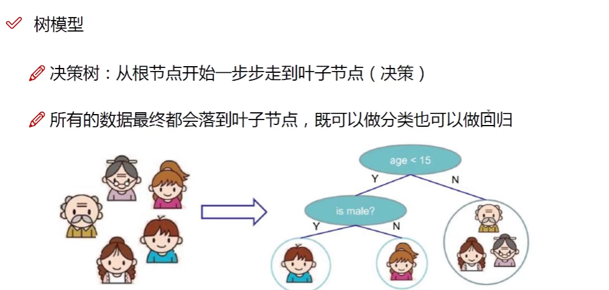
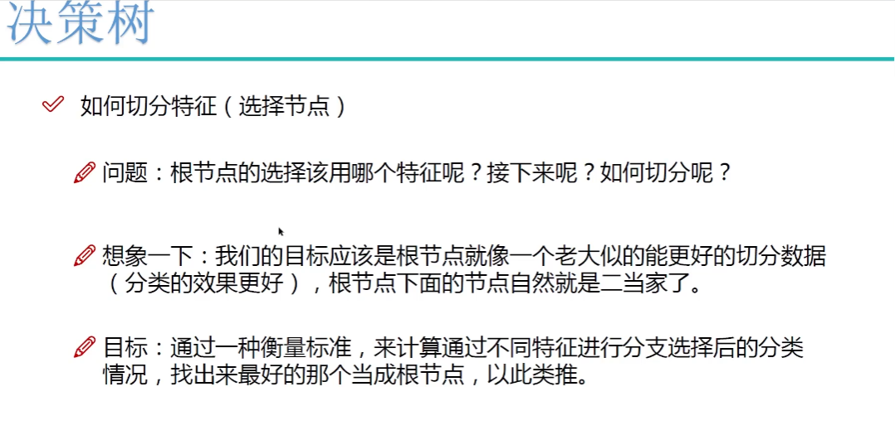
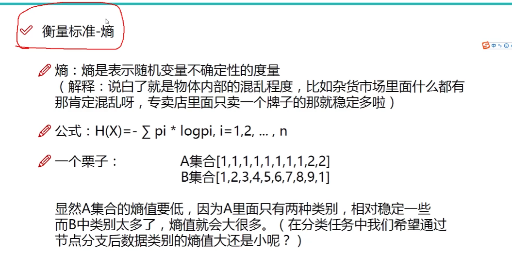
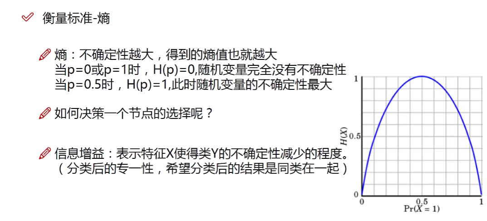
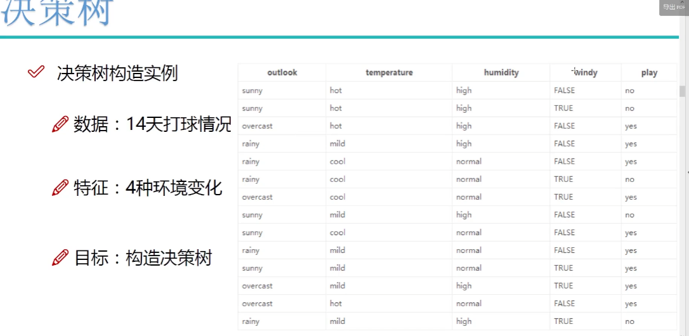
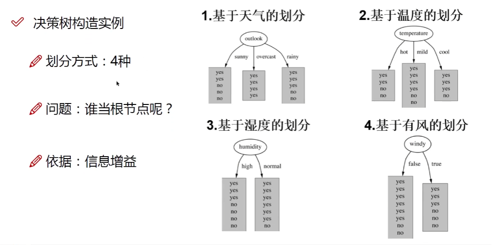
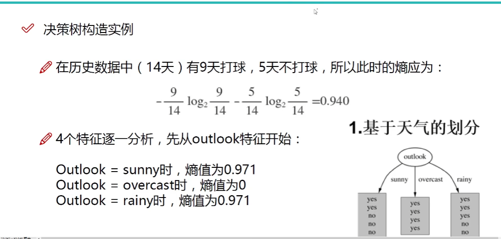
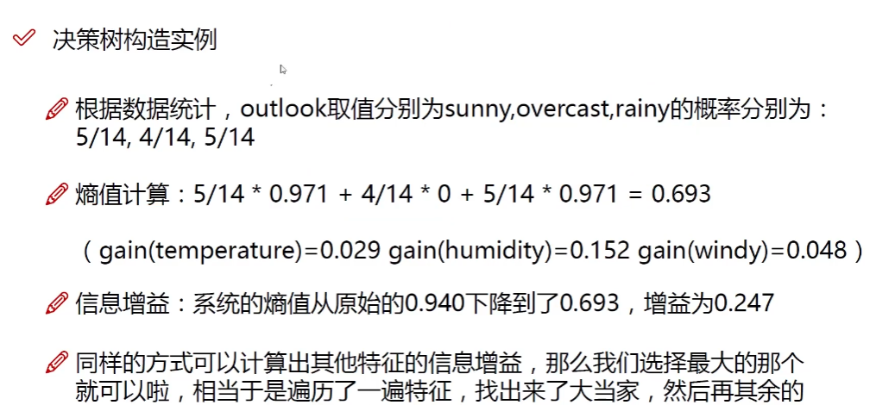
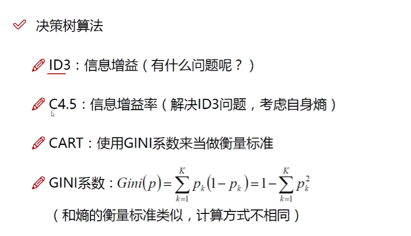

[第一章：决策树原理 1-决策树算法概述_哔哩哔哩_bilibili](https://www.bilibili.com/video/BV1zN41167xn?p=2&vd_source=55460d497036dd635125163b0e99f789)

ID3的问题：如果出现将ID作为特征，那么结果可能是一个ID下一个样本，算出来熵为0，纯度很高，但是ID对于分类是没有用的。

C4.5：使用信息增益率解决ID3的问题。按照ID分类成14个，算出来`ID的熵`为0，`假设原始的信息增益`为9，那么ID的信息增益为`假设原始的信息增益 - ID的熵 = 9`，但是信息增益率会除以一个数，减少这种不正常的信息增益值，这个数就是 $-\frac{1}{14}\log(\frac{1}{14})$ 。

CART：使用GINI系数

