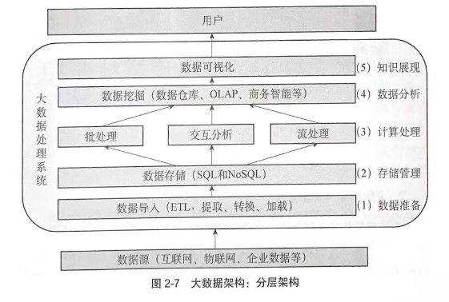

## 大数据的概念

大数据技术：从各种各样类型的数据中，快速高效地获得有价值信息的能力

Apache Hadoop对大数据的定义：通过传统的计算机在可接受的范围内不能捕获、管理和处理的数据集合

即：

1. 数据量大
2. 持续增加
3. 传统数据库技术不能有效管理

大数据的特征：

1. 数量（Volume）
2. 多样性（Variety）
3. 速度（Velocity）
4. 价值（Value）

大数据的表现形态：

1. 多源性
2. 实时性
3. 不确定性：数据、算法模型的不确定性

## 大数据的架构

### 云计算：

#### 定义：

2012国务院政府工作报告：基于互联网的服务的增加、使用和交付模式，通常涉及通过互联网来提供动态易拓展且经常是虚拟化的资源。

#### 云计算的特点

1. 资源池弹性可扩张：资源的集中管理和输出，即资源池
2. 需求服务自主化：按需向用户提供资源
3. 虚拟化：利用软件来实现硬件资源的虚拟化管理、调度及应用
4. 以网络为中心：应用服务通常都是通过网络来提供的
5. 高可靠性和安全性： 

## 大数据生命周期

大数据从数据源经过分析挖掘直到最终获得价值需要经过5个环节：

1. 数据准备
2. 数据存储与管理
3. 计算处理
4. 数据分析
5. 知识展现

## 大数据的分类

### 按照数据类型：

1. 传统企业数据
2. 机器和传感器数据
3. 社交数据

### 按照处理过程划分

1. 海量型数据
2. 响应型数据
3. 影随型数据：你可以拥有，但不容易拿到的数据：保安亭的出入数据
4. 过程型数据
5. 未知型数据

### 按照生产数据的主题划分

## 数据预处理

数据预处理方法有很多，包括如下：

### 数据清洗

需要清洗的数据类型：残缺数据、错误数据、重复数据、数据的不一致性

### 数据集成

将多个数据源中的数据结合起来并统一存储，建立数据仓库

### 数据变换

采用线性或非线性的数据变换方法将多位数据压缩成较少维的数据，消除它们在时间、空间、属性及精度等特征表现方面的差异。

将数据从一种表现形式变成另一种表现形式的过程

### 数据规约

在尽可能保持数据原貌的前提下，最大限度地精简数据量保持数据的原始状态。数据规约可以分为3类：

1. 特征规约
2. 样本规约
3. 特征值规约

## 大数据分析

是指收集、处理数据并获取数据中隐含的信息的过程。目的有：

1. 推测或解释数据并确定如何使用数据
2. 检查数据是否合法
3. 给决策制定合理建议
4. 诊断或推断数据错误原因
5. 预测未来将要发生的事情

数据分析可以分为三个层次：

1. 描述性分析：基于历史数据来描述发生的事件
2. 预测性分析：预测未来事件发生的概率和演化趋势
3. 规则性分析：解决决策制定和提高分析效率

数据分析活动步骤：

1. 数据获取和存储
2. 数据信息抽取及无用信息清洗
3. 数据整合和表示：转化成机器能够读取理解的格式
4. 数据模型的建立和结果分析
5. 结果阐释

分析数据：

主要依靠4项技术：统计分析、数据挖掘、机器学习和可视化分析

## 数据挖掘算法

从大量的、不完全的、有噪声的、模糊的、随机的实际应用数据中，提取隐含在其中的、人们实现不知道的、但有又是潜在在有用的信息和知识的过程。

## 大数据可视化

可视化的基本特征：

1. 易懂性：容易被人们理解和接受，为决策支持提供帮助
2. 必然性：由于数据量大，所以可视化必然要求人们对数据进行归纳总结，对数据的结构和形式进行转化处理
3. 专业性：往往只是从特定视角或需求认识数据
4. 片面性：可视化与专业知识紧密相连

可视化流程：

1. 数据获取
2. 数据处理
3. 可视化模式
4. 可视化应用

