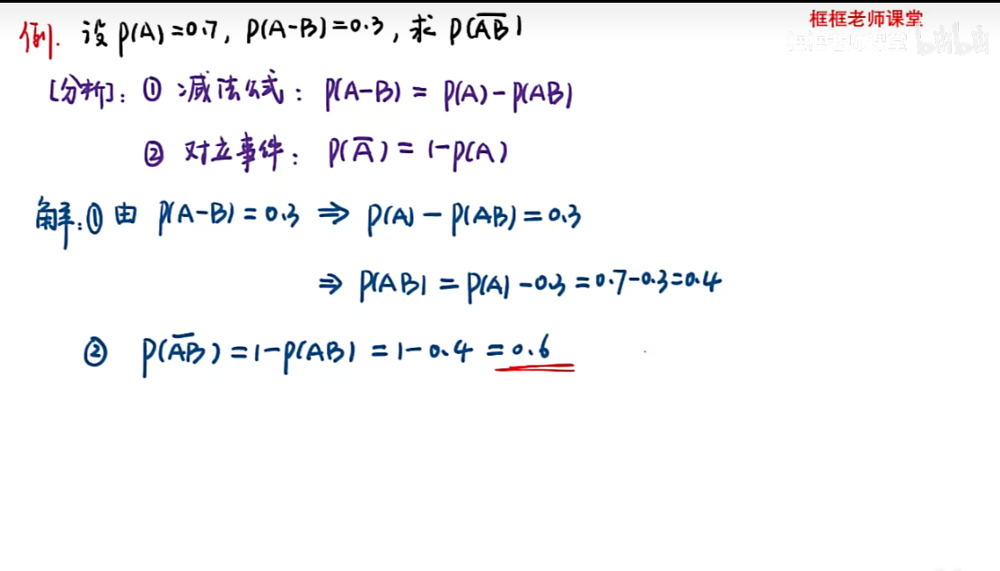
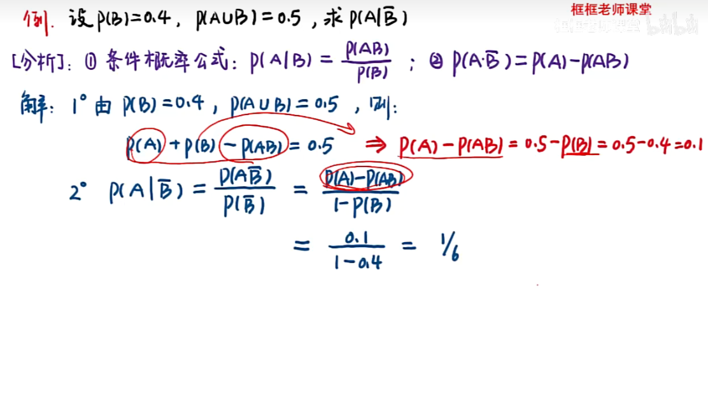
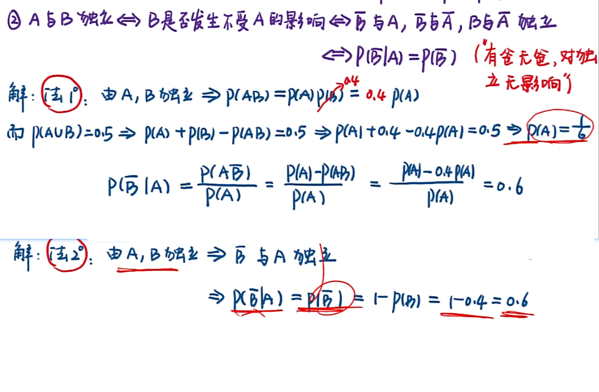
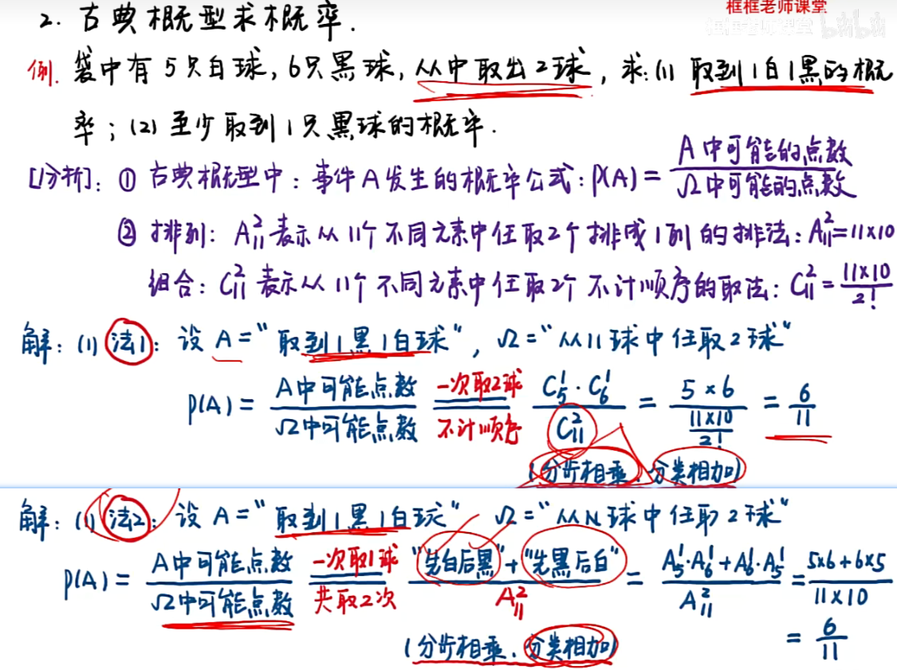
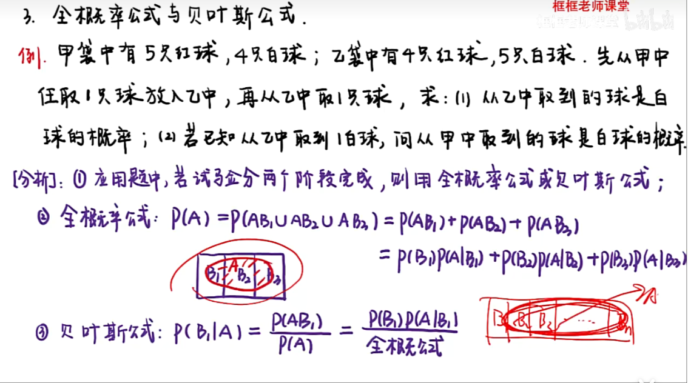
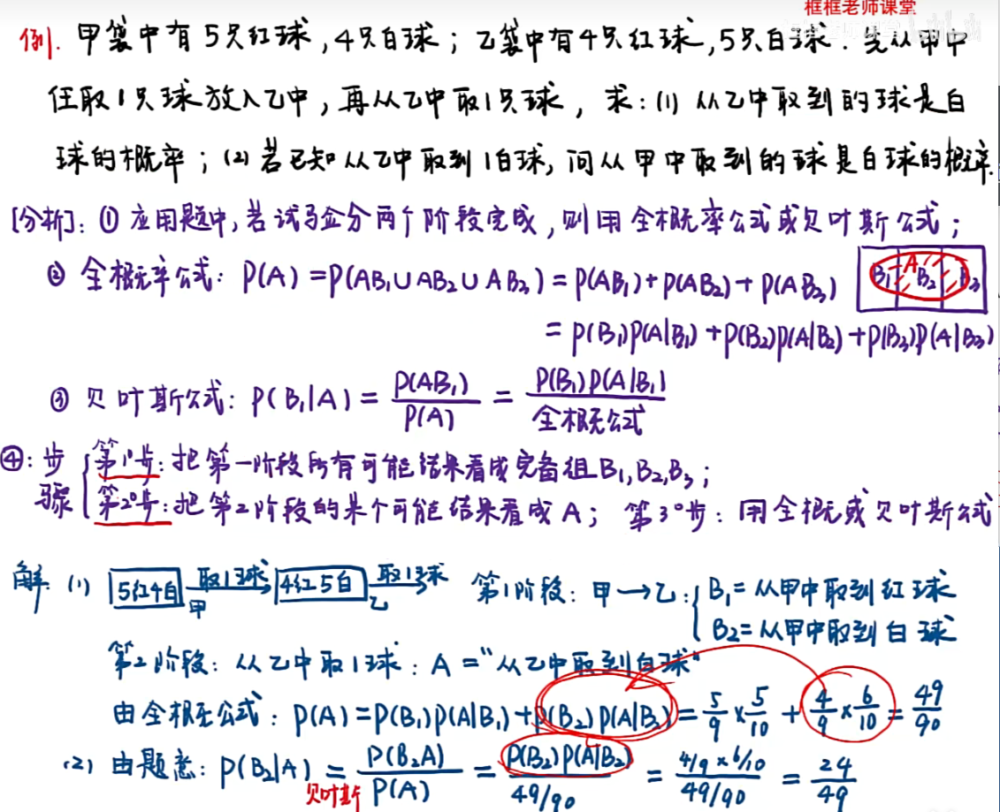
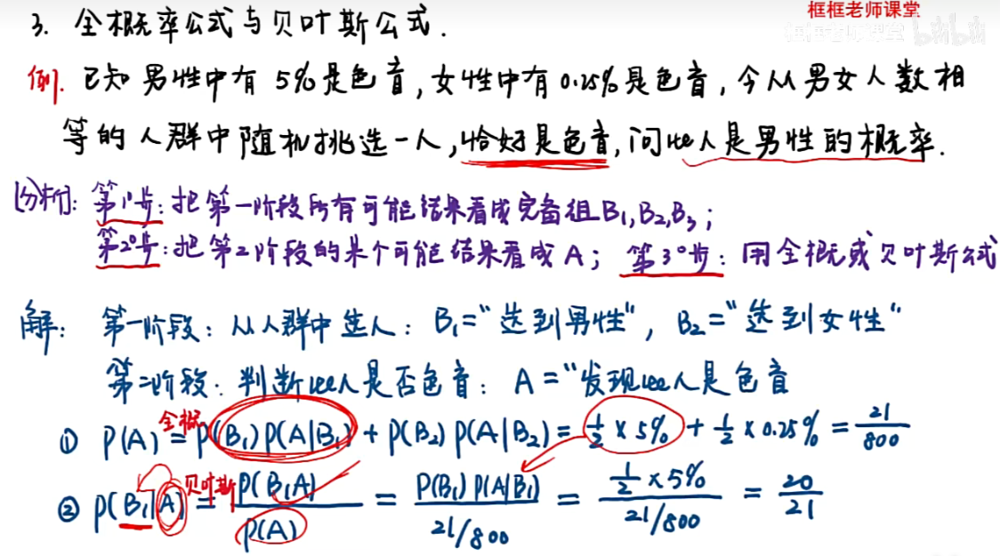

> [概率论与数理统计_哔哩哔哩_bilibili](https://www.bilibili.com/video/BV168411Z7pf?p=1&vd_source=55460d497036dd635125163b0e99f789)

## [第一章：随机事件及其概率（一）_哔哩哔哩_bilibili](https://www.bilibili.com/video/BV168411Z7pf?p=1&vd_source=55460d497036dd635125163b0e99f789)

## [第一章：随机事件及其概率（二）_哔哩哔哩_bilibili](https://www.bilibili.com/video/BV168411Z7pf?p=2&spm_id_from=pageDriver&vd_source=55460d497036dd635125163b0e99f789)

