> [第一章：聚类算法概述_哔哩哔哩_bilibili](https://www.bilibili.com/video/BV1ST411w7De?p=1&vd_source=55460d497036dd635125163b0e99f789)

## [K-Means算法](https://www.bilibili.com/video/BV1ST411w7De?p=1&vd_source=55460d497036dd635125163b0e99f789)

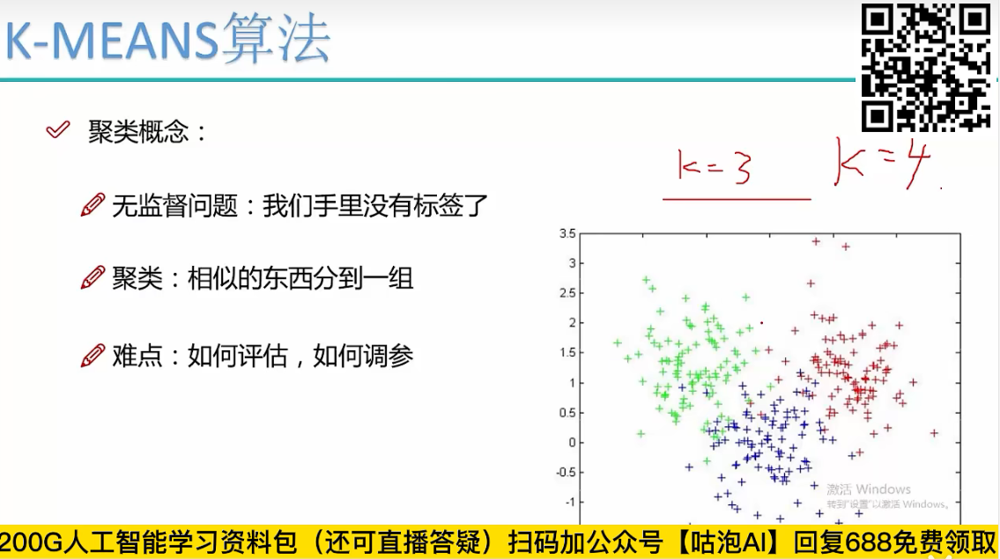

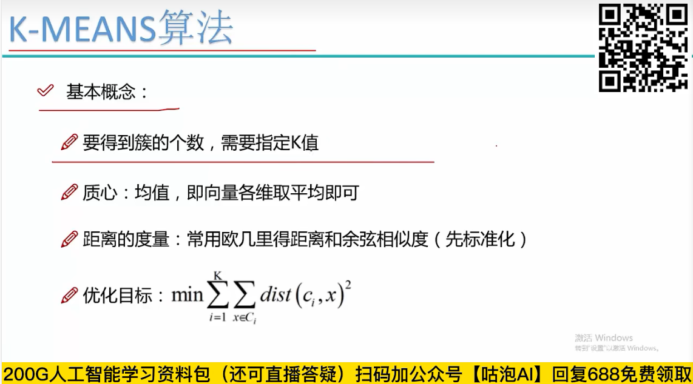

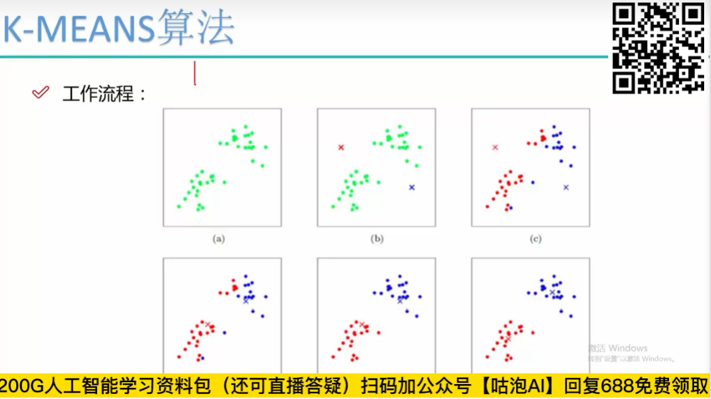

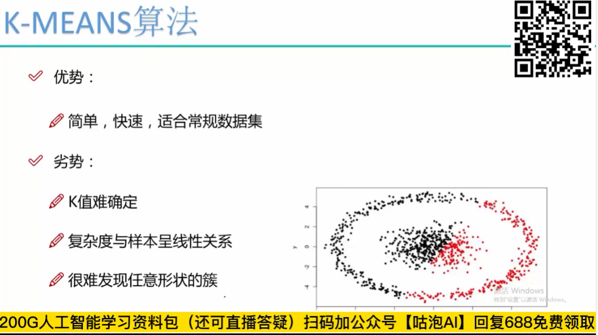 

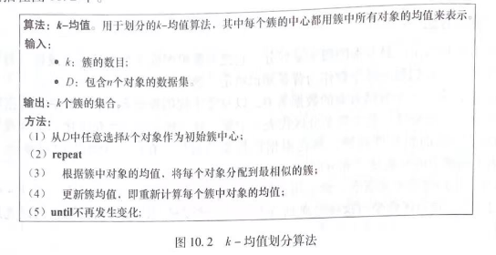

优点：

简单，快速，适合常规数据集

缺点：

K值难确定性

复杂度与样本呈线性关系

很那发现任意形状的簇

初始值对结果影响非常大，需要进行多次实验

## [DBSCAN算法](https://www.bilibili.com/video/BV1ST411w7De?p=4&spm_id_from=pageDriver&vd_source=55460d497036dd635125163b0e99f789)

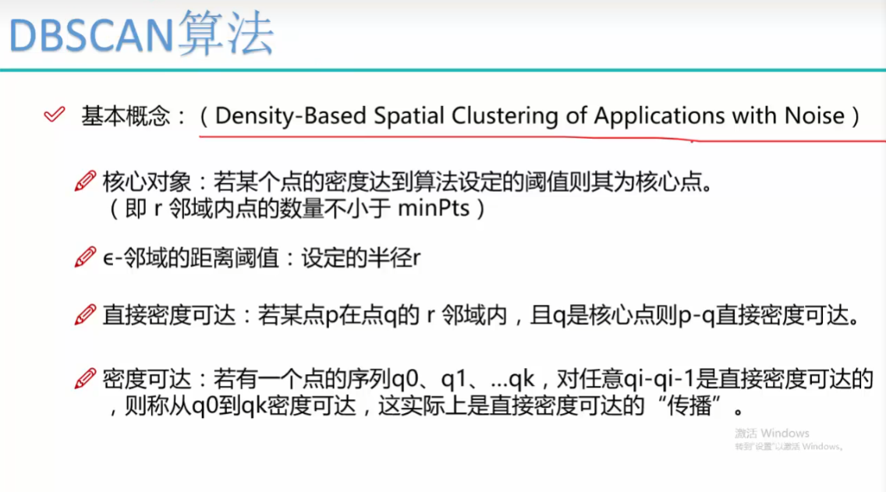

 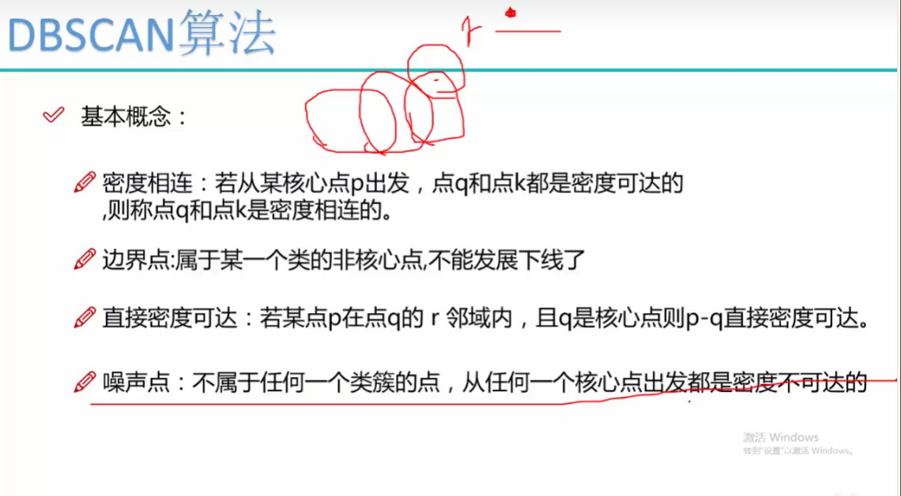

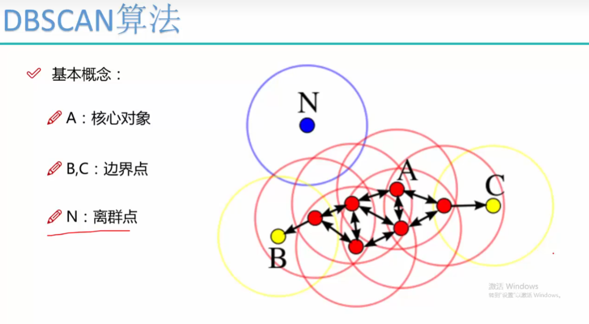

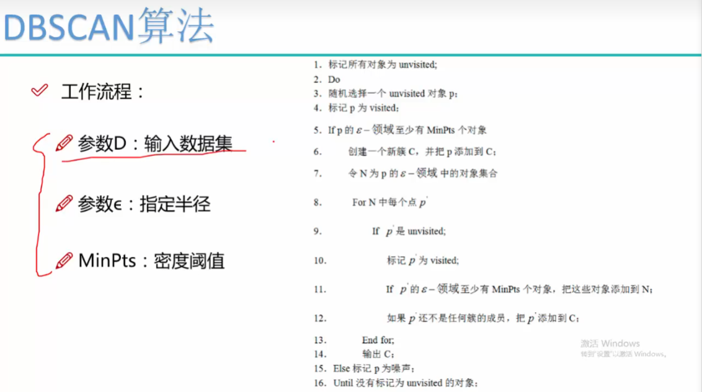

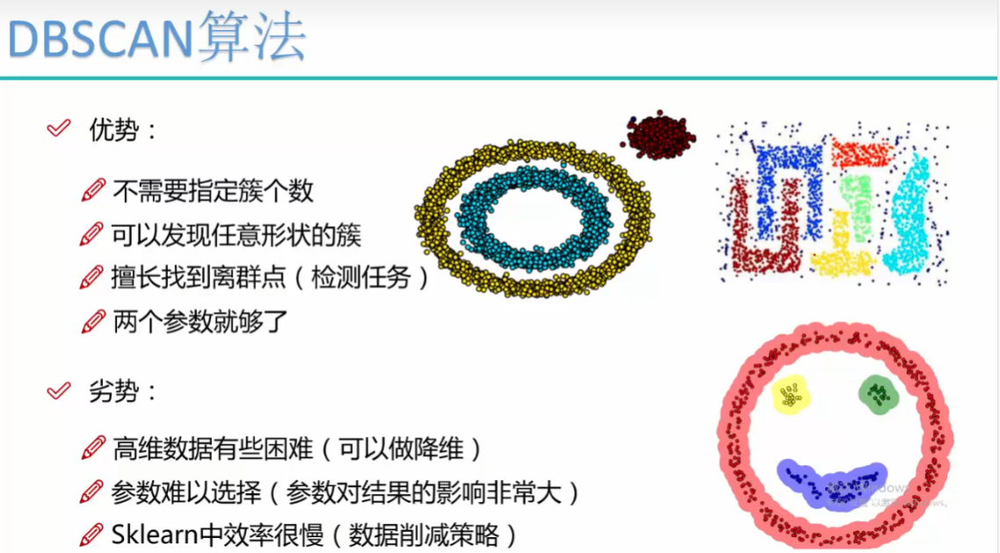

## [层次聚类](https://www.bilibili.com/video/BV1ST411w7De?p=24&vd_source=55460d497036dd635125163b0e99f789)

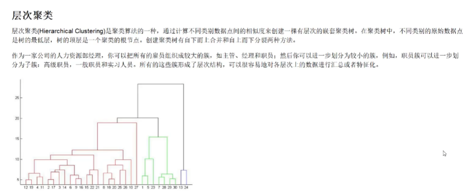

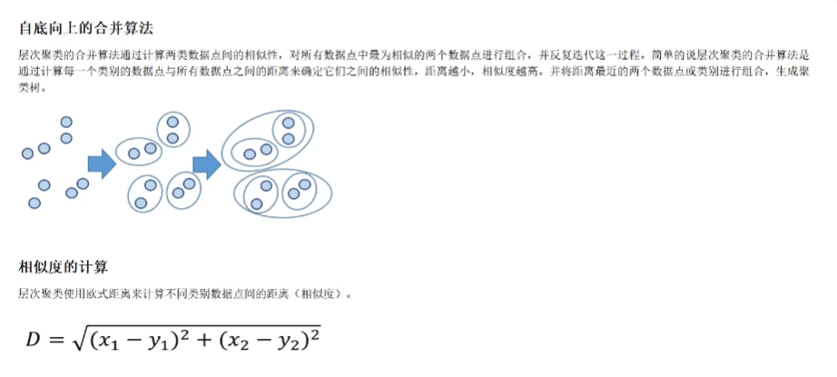

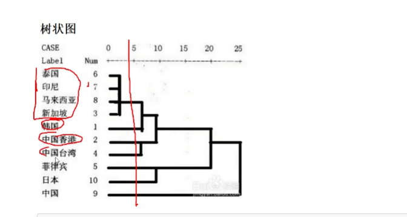

